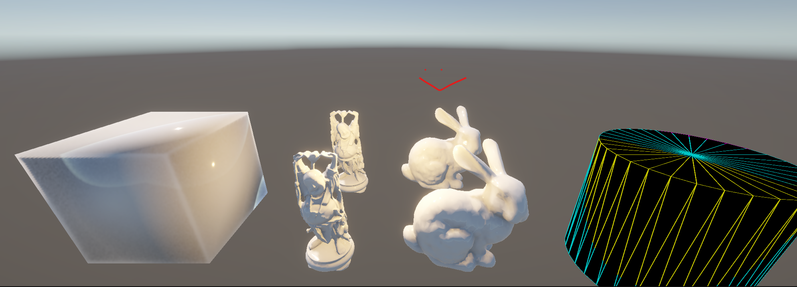

# Modélisation Géométrique
(For now) Objects are constructed on startup, meaning the "game" needs to be restarted to change parameters.
Positions can be altered via inspector in game and are updated.
Each scene can be easily navigated in the *Scene* window (and not *Game* window).
Scenes for each work can be found in the scene directory
## TP1
Scripts : (`*.cs`)
- CustomQuad
- CustomPlane
- CustomSphere
- CustomCylinder
- CustomCone

Every script can be attached to an empty object and has Serialized Fields for parameters.
## TP2 
Scripts : (`*.cs`)
- OFFMeshLoader
- ExportButtonEditor (button to export)
Loads the mesh specified by path
Button exports the mesh as an off following the given path and file name.

## TP3
Scripts : (`*.cs`)
- Octree
Loads an octree defined by bounds and depth (subdivision, 8 per depth).
The rendered object inside are defined by the `SceneSDF` function (each object is represented by a signed distance function).
Note : it would be best to use Unity Objects that later are converted via their parameters to SDFs.
