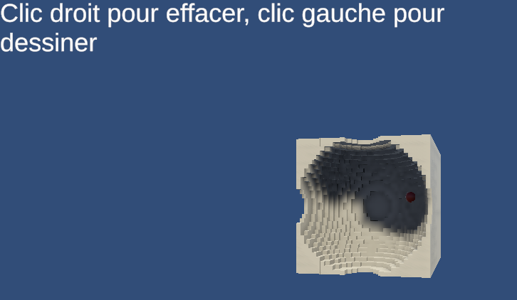

# Modélisation Géométrique
(For now) Objects are constructed on startup, meaning the "game" needs to be restarted to change parameters.
Positions can be altered via inspector in game and are updated.
Each scene can be easily navigated in the *Scene* window (and not *Game* window).
Scenes for each work can be found in the scene directory
## TP1
Scripts : (`*.cs`)
- CustomQuad
- CustomPlane
- CustomSphere
- CustomCylinder
- CustomCone

Every script can be attached to an empty object and has Serialized Fields for parameters.
## TP2 
Scripts : (`*.cs`)
- OFFMeshLoader
- ExportButtonEditor (button to export)
Loads the mesh specified by path
Button exports the mesh as an off following the given path and file name.

## TP3
Scripts : (`*.cs`)
- Octree

Loads an octree defined by depth (subdivision, 8 per depth).
The rendered object are defined by the `Scene` (a tree-like structures building a SDF using boolean operations).
The bounds of the tree are the bounds of the scene.
Cubes can be painted using the mouse (following a raycast), the ones changed/places are represented as red.

## TP4
Scripts : (`*.cs`)
- OFFMeshClustering

Loads a mesh from on OFF file at the specified path.
Renders the mesh using a material showing the cubes u,v,w coordinate range.
Simplifies the mesh in a (given) object's mesh with the same material showing.

